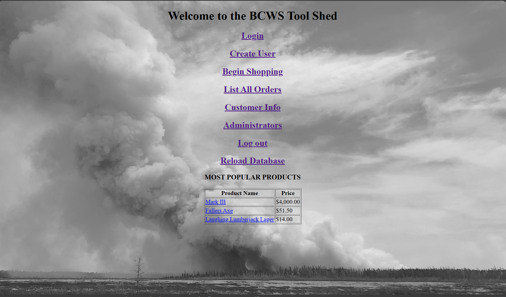
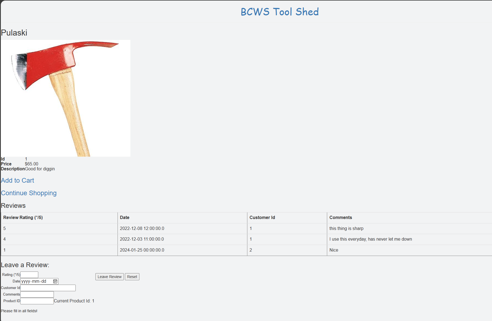
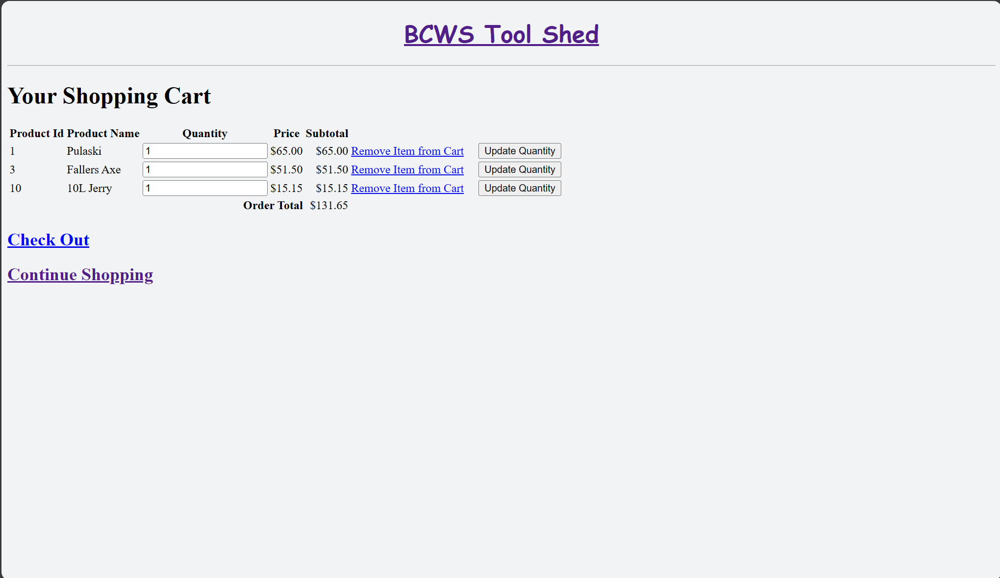
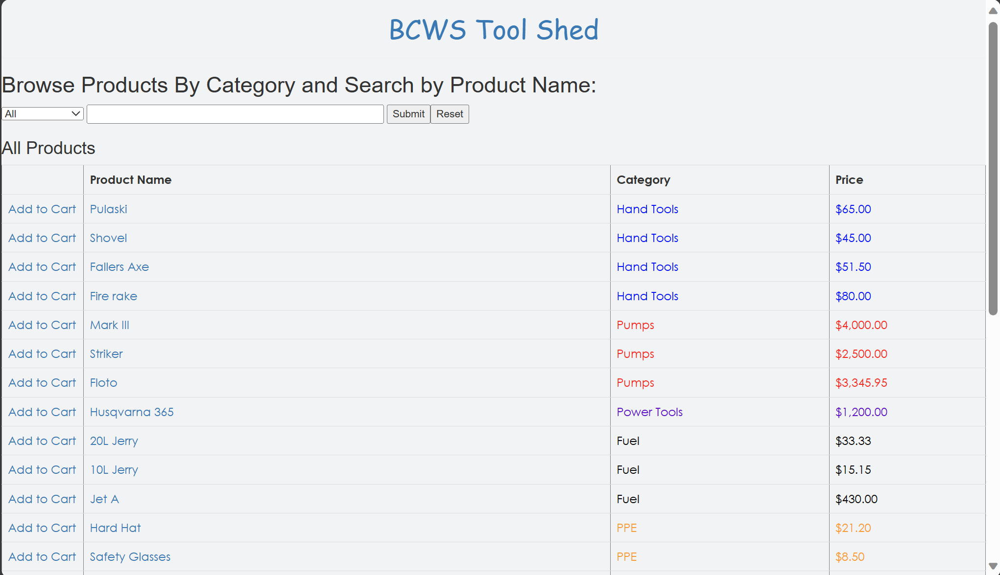
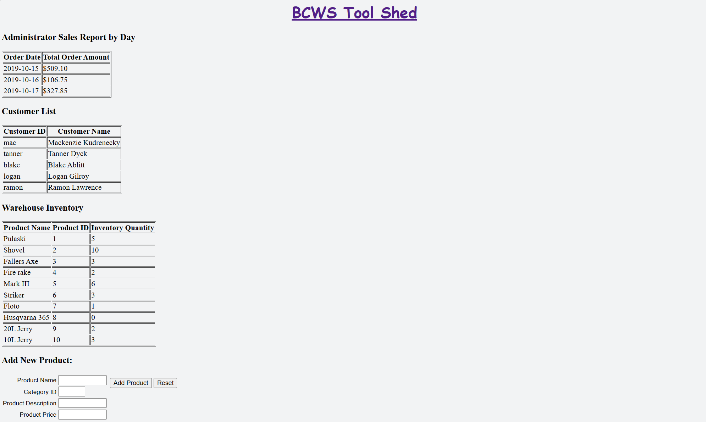

# Wildfire-E-commerce

The British Columbia Wildfire Service (BCWS) Tool Shed represents a collaborative effort for COSC 304 (Introduction to Databases, Fall 2022) at UBCO. Running on Docker, it utilizes containers for SQL Server and Apache Tomcat. Apache Tomcat manages the Java servlets on the website, while SQL Server stores data such as products, orders, and customer details. The primary objective of the project was to create a website capable of communication with a database, achieved through SQL and a database driver.

## Local Deployment

To run the site locally:

- use docker to run `docker-compose up -d` in the root directory
- go to http://localhost/shop/loaddata.jsp to load the data
- access home page http://localhost/shop, happy browsing!

## Screenshots

### Home Page

### Product Page

### Cart

### Browse

### Admin Page

## Reflections

This project was completed prior to having any web dev experience - no HTML, no CSS, (what the heck is JSP?) and it shows. It was a challenging project for a course that focused on SQL and databases. It was great entry point into learning HTML, embedding Java, running raw SQL queries, and seeing the action come to life in the browser (btw what is GET/POST?). After only a short year has passed since completing this project, it would be fun to re-visit, refactor and update the UI, but now for now it will remain a relic.
